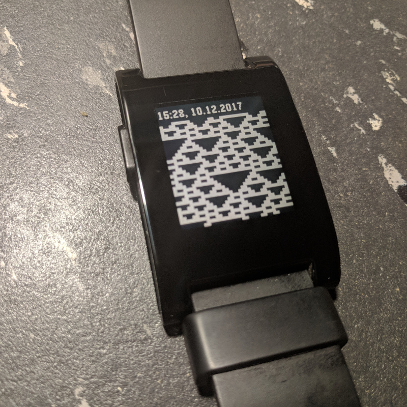

# pebble-wolfram

This watchface for the Pebble smartwatch visualizes [Wolfram's rules](http://mathworld.wolfram.com/ElementaryCellularAutomaton.html).

The rules are chosen by random and are started from random seeds with periodic
boundary conditions.

Since the watchface updates every second, the battery might be drained quicker
than normally.



## Setup

If the [Pebble SDK](https://developer.pebble.com/sdk/) is configured and the
developer server on the connected smartphone is enabled, this watchface can
be compiled and installed with

```
export PEBBLE_PHONE=192.168.X.Y
pebble build && pebble install
```
